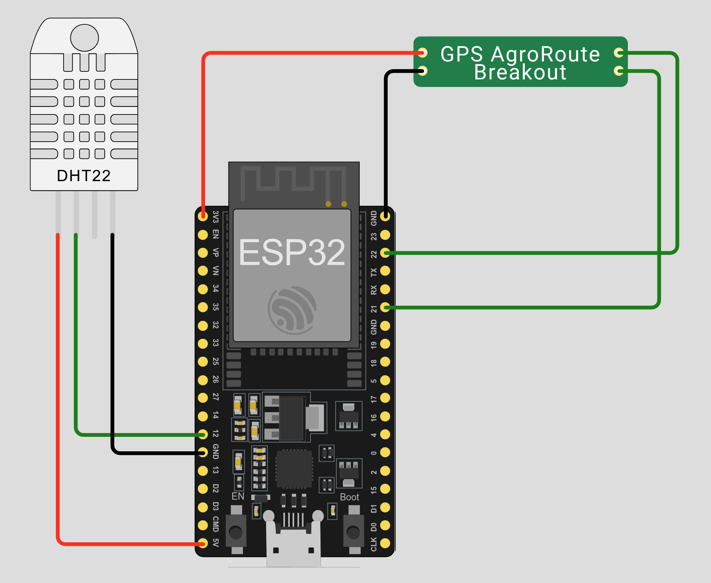

# AgroRoute IoT Demo

<p align="center">
  
</p>

Este proyecto simula un dispositivo IoT que:

* Mide temperatura y humedad con un **DHT22**.
* Simula datos de ubicación GPS mediante un **custom‑chip** (`gps-agroroute`).
* Publica un JSON con estos datos a un endpoint REST.

## Enlace al proyecto Wokwi

[Ver y editar en Wokwi](https://wokwi.com/projects/430893166627987457)

## Estructura de archivos

* **diagram.json**: Configuración del esquema de simulación (ESP32, DHT22, custom‑chip GPS).
* **libraries.txt**: Bibliotecas necesarias para Wokwi.
* **gps-agroroute.chip.json** / **gps-agroroute.chip.c**: Definición y lógica del GPS simulado.
* **sensors.h** / **sensors.cpp**: Lectura del sensor DHT22.
* **network.h** / **network.cpp**: Conexión Wi-Fi y envío de datos al endpoint.
* **agroroute.ino**: Sketch principal que orquesta la lectura, parseo de NMEA y envío.

## Instrucciones para ejecutar

1. Abre el proyecto en Wokwi haciendo clic en el enlace de arriba.
2. Pulsa **Run**.
3. Abre el **Serial Monitor** y selecciona **115200 bps**.
4. Observa las lecturas de sensor y las peticiones POST al endpoint.

## JSON enviado al endpoint

Cada 5 segundos se envía un payload como:

```json
{
  "deviceId": "HC2947",
  "dht22": {
    "temperature": 24.3,
    "humidity": 50.1
  },
  "gps": {
    "lat": -12.0464,
    "lon": -77.0428
  }
}
```

## Personalización

* Ajusta los pines del DHT22 o UART2 en `agroroute.ino` si cambias el cableado.
* Modifica las sentencias NMEA en `gps-agroroute.chip.c` para simular diferentes rutas.
* Actualiza la constante `ENDPOINT` en `network.cpp` para dirigir a tu API real.

---

© 2025 AgroRoute